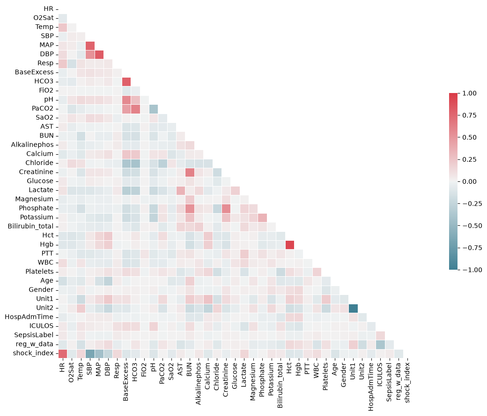
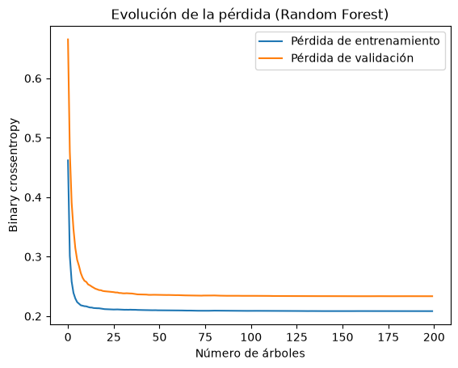
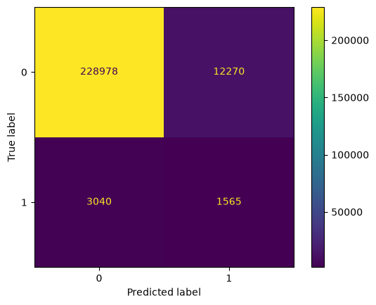

# Proyecto Hospital - Sepsis

## 1. Contexto y objetivos

- El contexto de este dataset es la predicción del estado de sepsis de pacientes que se encuentran actualmente en observación en urgencias. Las muestras son temporales, es decir, un paciente tendrá X número de registros, referenciando las diferentes observaciones de sus signos vitales a lo largo de su estancia.

- El campo más importante será el que confirma si durante X observación el paciente está sufriendo de sepsis o no.

- El objetivo que nos hemos propuesto es la creación de un modelo que puede discernir según los signos vitales de un paciente en una observación pueda determinar si sufre de sepsis o no.

## 2. Dataset (Sepsis - PhysioNet)

- Dataset: [Sepsis](https://physionet.org/content/challenge-2019/1.0.0/)

- Número de registros brutos: 1552210

| # | Campo | Descripción |
|---:|---|---|
| 1 | HR | Frecuencia cardíaca (latidos por minuto) |
| 2 | O2Sat | Saturación de oxígeno por pulsioximetría (%) |
| 3 | Temp | Temperatura (°C) |
| 4 | SBP | Presión arterial sistólica (mm Hg) |
| 5 | MAP | Presión arterial media (mm Hg) |
| 6 | DBP | Presión arterial diastólica (mm Hg) |
| 7 | Resp | Frecuencia respiratoria (respiraciones por minuto) |
| 8 | EtCO2 | Dióxido de carbono al final de la espiración (mm Hg) |
| 9 | BaseExcess | Medida del exceso de bicarbonato (mmol/L) |
| 10 | HCO3 | Bicarbonato (mmol/L) |
| 11 | FiO2 | Fracción inspirada de oxígeno (%) |
| 12 | pH | pH de la sangre arterial (sin unidad) |
| 13 | PaCO2 | Presión parcial de dióxido de carbono en sangre arterial (mm Hg) |
| 14 | SaO2 | Saturación de oxígeno en sangre arterial (%) |
| 15 | AST | Aspartato aminotransferasa (UI/L) |
| 16 | BUN | Nitrógeno ureico en sangre (mg/dL) |
| 17 | Alkalinephos | Fosfatasa alcalina (UI/L) |
| 18 | Calcium | Calcio (mg/dL) |
| 19 | Chloride | Cloruro (mmol/L) |
| 20 | Creatinine | Creatinina (mg/dL) |
| 21 | Bilirubin_direct | Bilirrubina directa (mg/dL) |
| 22 | Glucose | Glucosa en suero (mg/dL) |
| 23 | Lactate | Ácido láctico (mg/dL) |
| 24 | Magnesium | Magnesio (mmol/dL) |
| 25 | Phosphate | Fosfato (mg/dL) |
| 26 | Potassium | Potasio (mmol/L) |
| 27 | Bilirubin_total | Bilirrubina total (mg/dL) |
| 28 | TroponinI | Troponina I (ng/mL) |
| 29 | Hct | Hematocrito (%) |
| 30 | Hgb | Hemoglobina (g/dL) |
| 31 | PTT | Tiempo de tromboplastina parcial (segundos) |
| 32 | WBC | Recuento de leucocitos (recuento*10^3/µL) |
| 33 | Fibrinogen | Fibrinógeno (mg/dL) |
| 34 | Platelets | Plaquetas (recuento*10^3/µL) |
| 35 | Age | Edad en años (100 para pacientes de 90 o más) |
| 36 | Gender | Mujer (0) u hombre (1) |
| 37 | Unit1 | Identificador administrativo de la unidad de UCI (UCI médica, MICU) |
| 38 | Unit2 | Identificador administrativo de la unidad de UCI (UCI quirúrgica, SICU) |
| 39 | HospAdmTime | Horas entre el ingreso en el hospital y el ingreso en UCI |
| 40 | ICULOS | Duración de la estancia en UCI (horas desde el ingreso en UCI) |
| 41 | SepsisLabel | 1 desde 6 horas antes del inicio de la sepsis en adelante; 0 en el resto |
| 42 | patient_id | Identificador del paciente (añadido en la carga: nombre del fichero `.psv`) |
| 43 | hospital | Hospital A o B (añadido en la carga: carpeta de origen) |

### 2.1. Variable objetivo

- El objetivo de nuestro modelo será `SepsisLabel` mediante predicciones con el uso del resto de las variables.

## 3. Análisis del dataset

- Según la documentación oficial, los campos se dividen en tres bloques: los 8 primeros suponen las constantes vitales del 9 al 34 son valores que han sido obtenidos mediante tratamiento en laboratorio y del 35 al 40 son los datos demográficos y administrativos del ingreso. El campo 41 es la etiqueta que usaremos para posteriormente el entrenamiento del modelo.

- El dataset en general se encuentra bastante desbalanceado en cuanto a lo que en casos se refiero, en torno al 2 % de los registros tienen `SepsisLabel = 1`. Esto supone un problema a tener en cuenta, porque un modelo que predijera siempre "no sepsis" obtendría sobre un 93-98% de accuracy sin detectar ningún caso.

- El reparto de registros dada la variable objetivo es un ~2%, siendo el 98% registros donde los pacientes no sufren de sepsis, lo que no añade un reto de sobreajuste para el modelo a desarrollar. Entre las soluciones que barajamos en un inicio fue el recoger de forma aleatoria una sección de los registros sin sepsis hasta conseguir un número equilibrado 50-50 de ambos tipos, pero al ser un reparto tan desproporcionado fue descartado.

- Otro aspecto notable del dataset es el hecho de que no en todas las instancias de medición habrá datos de laboratorio, sino que se realizan en periodos de tiempo mayores a los registrados, lo que crea valores nulos en los campos de laboratorio.

### 3.1. Matriz correlación

| Variables | Correlación | Interpretación |
|---|---|---|
| SBP, MAP, DBP | Positiva alta | Las tres miden la presión arterial |
| Hct, Hgb | Positiva muy alta | Es debido a que el hematocrito y hemoglobina miden casi lo mismo |
| BaseExcess, HCO3, pH, PaCO2 | Media-alta | Se interpreta así debido a que los datos proceden todos de la rama de gasometría |
| BUN, Creatinine, Phosphate | Positiva media | Tienen parte de relación debido a que actúan en funciones renales|
| Unit1, Unit2 | Negativa casi perfecta | Se complementan ambas, ya que un paciente este en una unidad o en otra |
| shock_index con HR y SBP | Positiva y negativa altas | Tienen una relación en ambos flancos alta debido a que `shock index` procede de la división de HR y SBP |
| SepsisLabel con el resto | Cercana a 0 | Puede llegar a relacionarse con ICULOS, que son las horas del paciente, pero es muy débil. |

#### Conclusiones que podemos extraer sobre el análisis planteado

- No existen variables o columnas que por sí solas determinen si un paciente tiene sepsis o no, es decir, no hay variables independientes.

- Se pueden encontrar grupos de variables que son redundantes entre sí (Hct/Hgb, Unit1/Unit2...)

- Debido a que la matriz de correlación se hace sobre un desbalance de etiquetas entre casos que tienen sepsis y que no tienen, la matriz de correlación nos sirve más para ver redundancia en los datos más que para descartar columnas o variables por completo. 

## 4. Limpieza del dataset

### 4.1. Descartes y transformaciones

| # | Paso | Qué se hace | Resultado |
|---:|---|---|---|
| 1 | Outliers | En 6 columnas que se detctaron valores anomalos, se sustituyen los valores fuera de un rango establecido por nulo | 1552210 registros, 43 columnas |
| 2 | Arrastre de valores | En las 34 columnas de datos clínicos, cada valor nulo que se encuentre se rellena con el último valor encontrado del mismo paciente (`ffill` agrupado por `patient_id`) | 1552210 registros, 43 columnas |
| 3 | Columnas vacías | Se eliminan las columnas con más del 80 % de valores nulos | 1552210 registros, 39 columnas |
| 4 | Registros vacíos | Se eliminan los registros que no tienen ningún dato clínico que nos aporte valor | 1518109 registros, 39 columnas |
| 5 | Feature engineering | Se crean dos columnas nuevas a partir de las existentes: `reg_w_data` y `shock_index` | 1518109 registros, 41 columnas |

- Rangos que se han aplicado a la hora de realizar el filtrado de los outliers:

| Columna | Mínimo | Máximo |
|---|---:|---:|
| HR | 20 | 250 |
| O2Sat | 50 | 100 |
| Temp | 30 | 43 |
| SBP | 40 | 280 |
| MAP | 20 | 200 |
| Resp | 4 | 70 |

- Columnas tras el filtrado realizado sobre los datos

| Tipo | Columnas | Motivo |
|---|---|---|
| Eliminadas | `EtCO2`, `Bilirubin_direct`, `TroponinI`, `Fibrinogen` | Incluso habiendo hecho `ffill()` han seguido quedando valores por encima del 80% de nulos, lo que desencadena sus eliminaciones |
| Limpiadas | `HR`, `O2Sat`, `Temp`, `SBP`, `MAP`, `Resp` | Se encontraron valores fuera de rango que se convirtieron directamente a Nulo |
| Rellenadas | Todas las columnas de datos sobre constantes vitales y de laboratorio | Arrastre de de valores del paciente según proceda si es nulo o no |
| Añadidas | `reg_w_data` | Número de columnas clínicas sin dato en ese registro en concreto |
| Añadidas | `shock_index` | Índice de shock: `HR / SBP` |

### 4.2. Resultado limpieza

Número de registros tras aplicar las reglas de calidad: **1518109** -> En total se eliminaron 34101 registros que aportaban información no conluyente.

Campos finales del dataset: 41

| Grupo | Nº | Campos |
|---|---:|---|
| Constantes vitales | 7 | HR, O2Sat, Temp, SBP, MAP, DBP, Resp |
| Laboratorio | 23 | BaseExcess, HCO3, FiO2, pH, PaCO2, SaO2, AST, BUN, Alkalinephos, Calcium, Chloride, Creatinine, Glucose, Lactate, Magnesium, Phosphate, Potassium, Bilirubin_total, Hct, Hgb, PTT, WBC, Platelets |
| Demográficas | 6 | Age, Gender, Unit1, Unit2, HospAdmTime, ICULOS |
| Objetivo (Etiqueta) | 1 | SepsisLabel |
| Identificadores | 2 | patient_id, hospital |
| Creadas | 2 | reg_w_data, shock_index |

De estos 41 campos, 38 se usan como datos de entrada del modelo: todos salvo `SepsisLabel`, `patient_id` y `hospital`, donde `SepsisLabel` coincide con las etiquetas que se usarán ene l entrenamiento del modelo, `patient_id` será eliminado cuando se haga el split de datos entre test, validación y entrenamiento, por último `hospital` era usada como gúia para distinguir registros entre hospitales, será eliminada para el entrenamiento.

### 4.3. Partición train/validation/test

La partición se hace por paciente en vez de por registro, de esa manera todos los registros de un paciente quedan dentro de un mismo dataframe, sin tener horas de pacientes mezcaladas.

| # | Paso | Realizado |
|---:|---|---|
| 1 | Train / test | Se obtiene la lista de pacientes únicos, la mezclamos con semilla 42 y el 20 % de los pacientes pasa a ser parte del conjunto de test |
| 2 | Relleno con las medianas por columna | Se calcula la mediana de cada columna numérica sobre el dataframe de train y con ella se rellenan los nulos restantes tanto de train como de test |
| 3 | Train / validación | De los pacientes de train, se vuelve a mezclar con semilla 42 y el 20 % pasa a formar parte del dataframe de validación |
| 4 | Entradas y etiqueta | Se eliminan `patient_id` y `hospital`, se separa `SepsisLabel` como etiqueta y los datos se convierten a `float32` para mejor comprensión para el modelo |

| Conjunto | Registros |
|---|---:|
| Entrenamiento (Sin separación en validación) | 1214397 |
| Entrenamiento | 968544 |
| Validación | 245853 |
| Test | 303712 |

Tras el relleno realizado con las medianas por columna, no queda ningún dato sin rellenar tanto en el dataframe de entrenamiento, como en test.

## 5. El modelo

### 5.1. Pruebas

- La primera prueba fue una red neuronal en Keras usando TensorFlow, con una capa de normalización y una salida sigmoide, como no nos dío buenos resultados y se aprendía casi siempre los datos, por lo cuál no generalizaba, obviamos esa opción.
- Después se probó usando Random Forest en Scikit-Learn, que es el modelo con el que nos hemos quedado y el que se describe a continuación:

### 5.2. Creación

El modelo es un `RandomForestClassifier` de Scikit-Learn. Cada árbol del bosque se entrena con una muestra aleatoria distinta de los datos, de forma que los árboles van a ir aprendiendo sobre registros distintos.

| Parámetro | Valor | Qué hace |
|---|---|---|
| `n_estimators` | 200 | Número de árboles que tendrá el bosque |
| `min_samples_leaf` | 50 | Número mínimo de registros contendrá cada hoja de los árboles |
| `max_samples` | 0.2 | Cada árbol se entrena con una muestra aleatoria del 20 % de las filas |
| `class_weight` | `"balanced_subsample"` | Da más peso a la muestra que contenga datos más pequeños, los pesos se sjustan con la muestra de cada árbol |
| `n_jobs` | -1 | Usa todos los núcleos de la CPU |
| `random_state` | 42 | Utilizamos 42, para que el resultado sea reproducible |

El modelo recibe 38 variables de entrada por observación y predice `SepsisLabel`.

### 5.3. Entrenamiento

El modelo se entrena con el conjunto de entrenamiento, dejando fuera validación y test que se usarán más adelante.

En el DAG de Airflow, el entrenamiento lo realiza la función `sepsis_rd_train` que se encuentra dentro del archivo [model_training.py](../app/airflow/dags/src/sepsis/model_training.py) de la carpeta `sepsis`, que recoge los conjuntos de entrenamiento, validación y test generados por la tarea que le ha precedido y entrena el modelo dentro de MLFlow (apartado 7).

Para comprobar cómo evoluciona el modelo, en el cuaderno calculamos la pérdida (`binary crossentropy`) de entrenamiento y de validación a medida que se añaden árboles al bosque:

- Ambas pérdidas caen con rapidez durante los primeros árboles recorridos y se estabilizan a partir de unos 25-50 árboles.
- Con los 200 árboles que usamos en el entrenamiento, la pérdida de entrenamiento queda sobre a 0,21 y la de validación sobre 0,23.
- Las dos curvas se mantienen iguales y la de validación no vuelve a subir.

### 5.4. Evaluación

El modelo se evalúa sobre los conjuntos de validación y test con tres métricas diferenciadas: Para la accuracy y la matriz de confusión se usa un umbral de 0,5 sobre lo que nos devuelve el modelo.

| Métrica | Validación | Test |
|---|---:|---:|
| AUPRC | 0,1007 | 0,0941 |
| Pérdida (log loss) | 0,2335 | 0,2250 |
| Accuracy (umbral 0,5) | 0,9377 | 0,9422 |

Se usa el umbral de 0,5 por ser el valor por defecto y un punto neutral:

- Si se baja el umbral, aumenta la detección de sepsis, pero con muchos falsos positivos.
- Si se sube, disminuyen los falsos positivos, pero se dejan sin detectar casos que son positivos reales.

Matriz de confusión sobre validación:

| | Predicho: No sepsis | Predicho: Sepsis |
|---|---:|---:|
| Real: No sepsis | 228978 | 12270 |
| Real: Sepsis | 3040 | 1565 |

- De los 4605 registros con sepsis, el modelo detecta 1565 como positivos (34,0 %).
- De los 13835 registros que marca como sepsis, 1565 lo son realmente (11,3 %).

### 5.5. Predicción

- Tras el entrenamiento, el modelo devuelve para cada registro la probabilidad de que corresponda a sepsis (`predict_proba`).
- Esa probabilidad la comparamos con el umbral de 0,5: por encima predecimos que es sepsis y por debajo no.
- En el proyecto, las predicciones se hacen únicamente sobre los conjuntos de validación y test, para evaluar el modelo de manera fiable.

### 6. Flujo Airflow

- El flujo de Airflow reproduce, tarea a tarea, los mismos pasos del cuaderno de Jupyter, pero adaptado a AirFlow, el código está segmentado en dos ficheros: `data_processing.py` (Pre-procesado: carga y limpieza) y `model_training.py` (Entrenamiento del modelo y previo registro en MLFlow).

Nuestro punto de carga de datos es `sepsis_parquet_raw.parquet`, que se genera previamente desde el cuaderno, recorriendo todos los ficheros `.psv` de `training_setA` y `training_setB`, seguidamente guardamos el dataframe generado dentro de la carpeta `/opt/airflow/parquets/`.

| # | Tarea | Función | Qué hace | Fichero |
|---:|---|---|---|---|
| 1 | `cargar_dataset` | `sepsis_ds_charge` | Lectura de datos en crudo | `01_carga` |
| 2 | `filtrado_outliers` | `sepsis_outliers_filtering` | Establecemos rangos y filtramos los datos que se encuentran fuera de los mismos | `02_outliers` |
| 3 | `rellenar_columnas_datos_vitales` | `sepsis_clinic_columns_fill` | Arrastramos el siguiente valor conocido del paciente hacía el registro anterior nulo (Si existe) | `03_ffill` |
| 4 | `eliminar_columnas_valores_nulos` | `sepsis_null_columns_drop` | Elimina las columnas con más del 80 % de nulos | `04_columnas_nulas` |
| 5 | `eliminar_constantes_nulas` | `sepsis_null_constants_drop` | Elimina las observaciones que no aportan ningún dato clínico | `05_constantes_nulas` |
| 6 | `feature_engineering` | `sepsis_feature_engineering` | Crea `reg_w_data` y `shock_index` | `06_features` |
| 7 | `split_train_test` | `sepsis_train_test_split` | Separa datos de train y test por paciente | `07_train`, `07_test` |
| 8 | `rellenar_datos_medianas` | `sepsis_medians_fill` | Rellenamos los nulos con las medianas que genera cada columna de train | `08_train`, `08_test` |
| 9 | `separar_train_validation_test` | `sepsis_train_val_test_split` | Separamos los datos de validación por paciente y eliminamos las columnas que contienen texto | `09_tr`, `09_val`, `09_test` |

- Cada tarea guarda su dataframe como fichero `.parquet` en `/opt/airflow/datos/sepsis_tmp/` y devuelve la ruta del fichero.
- AirFlow almacena esa ruta en XCom. La tarea siguiente la recupera usando `ti.xcom_pull()` y lee el parquet.
- De esta forma, por XCom solo pasaran rutas y no los datos, debido a que Airflow no puede deserializar los datasets. Las tareas que generan varios conjuntos (7, 8 y 9) devuelven una ruta por cada uno.
- Al quedar guardado el resultado de cada paso, se puede revisar el estado del dataset en cualquier punto de la ejecuciñon del DAG en AirFlow.

### 7. Versionado con MLflow

- El versionado del modelo se realiza en la misma tarea en la que el DAG entrena el modelo (`sepsis_rd_train`), se conecta al servidor de MLflow y registra el modelo cada vez que se ejecuta.

| Elemento | Valor | Para qué sirve |
|---|---|---|
| Servidor de tracking | `http://mlflow:5000` | Servidor de MLflow utilizado para subir el modelo |
| Experimento | `Experimento Sepsis` | Agrupa todas las ejecuciones del proyecto |
| Ejecución (run) | `RandomForest_Base` | Ejecución en la que se realiza el entrenamiento, indicamos el algoritmo usado para entrenar el moelo |
| Artefacto | `model` | Modelo con el entrenamiento realizado, guardado con `mlflow.sklearn.log_model` |
| Modelo registrado | `Clasificador_RF_Sepsis` | Nombre del modelo en el registro de modelos |

- Cada ejecución del DAG crea una ejecución nueva en el experimento y una versión nueva de `Clasificador_RF_Sepsis`, de forma que quedan guardados todos los modelos entrenados y se puede ver cada uno de ellos por su número de versión.

- Las métricas de evaluación (AUPRC, pérdida y accuracy) son calculadas en la misma tarea y se muestran en el log de la tarea en Airflow.

### 8. Limitaciones y consideraciones

- Una de las principales limitaciones que se ha encontrado a la hora de entrenar el modelo es la conformidad del Dataset, como hemos visto en la exploración existen muchos más registros (98%) que pertenecen a observaciones que no tienen sepsis frente a bastantes menos registros (~2%) que peretenecen a pacientes con sepsis en esa hora concreta.

- A la hora de entrenar el modelo, es difícil conseguir que distinga correctamente los pacientes con sepsis y los que no, ya que los que no tienen sepsis prevalecne sobre lo sque tienen, por tanto el modelo va a tender generalmente a dar falsos positivos sobre los registros que no son sepsis, dentro de esos registros que no son sepsis y da falsos positivos, el modelo será capaz de predecir en algunos casos pacientes con sepsis que la padecen realmente.

