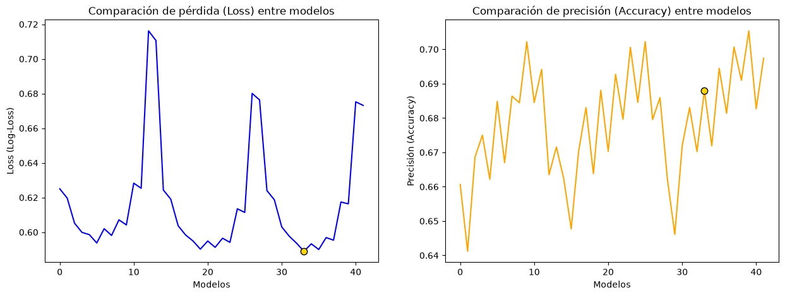
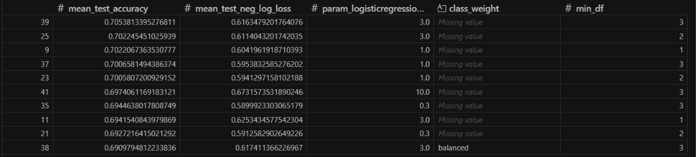
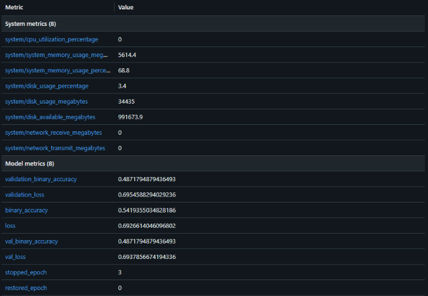
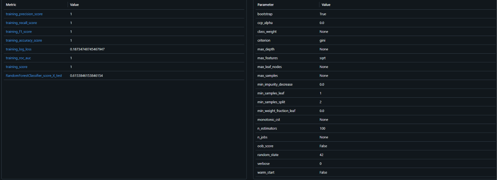
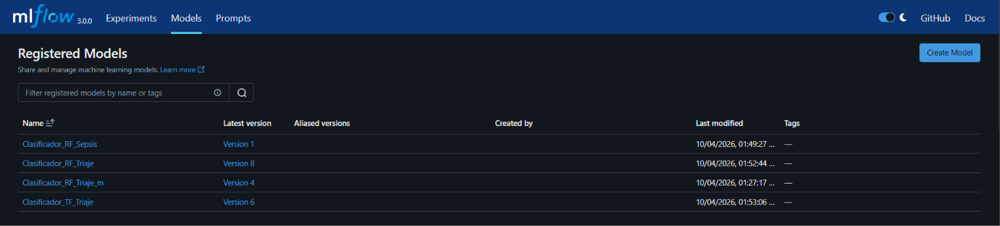

# Proyecto Urgencias

## 1. Contexto y objetivos

La saturación de las urgencias representa un desafío para la eficiencia operativa. La correcta priorización de un paciente a su llegada a urgencias es vital para garantizar que aquellos con condiciones críticas sean atendidos con la mayor brevedad posible, optimizando los recursos disponibles.

Se requiere entrenar, diseñar e integrar un modelo con el objetivo de determinar el nivel de urgencia de un paciente a su llegada a urgencias permitiendo una priorización más ágil y eficaz.

## 2. Dataset (MIMIC-IV-ED Demo)

Dataset: [MIMIC-IV-ED Demo](https://physionet.org/content/mimic-iv-ed-demo/2.2/)
Número de registros brutos: 222
Campos: 
    1. subject_id	
    2. stay_id	
    3. temperature	
    4. heartrate	
    5. resprate	
    6. o2sat	
    7. sbp	
    8. dbp	
    9. pain	
    10. acuity	
    11. chiefcomplaint

### 2.1. Variable objetivo

`acuity`

La variable que buscamos predecir, llamada acuity, indica el nivel de urgencia o la gravedad con la que llega un paciente a urgencias. Funciona como una escala del 1 al 5: los números más bajos (como el 1 y el 2) corresponden a situaciones críticas que exigen atención médica inmediata para evitar riesgos vitales, mientras que los valores del 3 al 5 son para casos más estables o menores. 

Para que al modelo le resulte más sencillo entenderlo, esta escala se simplifica en dos grandes grupos (separando los casos más graves de los que pueden esperar), lo que sirve de guía para que el sistema aprenda a relacionar las constantes vitales del paciente con la prioridad médica real que recibió.

## 3. Análisis del dataset
Para el desarrollo y entrenamiento del sistema de triaje predictivo se ha empleado el conjunto de datos [MIMIC-IV-ED](https://physionet.org/content/mimic-iv-ed-demo/2.2/) en su versión de demostración (Demo 2.2) disponible en PhysioNet.

Este dataset proporciona registros clínicos estructurados, anónimos y de alta fidelidad procedentes de los servicios de urgencias de un hospital de gran escala, simulando un entorno clínico real y complejo.

### 3.1. Matriz correlación


## 4. Limpieza del dataset

### 4.1. Descartes y transformaciones

- Limpiar valores nulos de todos los campos y eliminar esos registros.
- Eliminar las columnas `subject_id` y `stay_id` por no ser datos relevantes para el entrenamiento del modelo.
- Eliminar la columna `chiefcomplaint` por la inconsistencia de su contenido y la dificultad de normalizar sus valores.
- Binarizar `acuity` a:
  - 0: urgente (acuity 1-2)
  - 1: no urgente (acuity 3-5)
- Reemplazar por 0 en columna `pain` los valores UA, unable, uta, ett, o.

### 4.2. Resultado limpieza

Número de registros tras limpieza: 190
Campos finales del dataset: 
    1. temperature	
    2. heartrate	
    3. resprate	
    4. o2sat	
    5. sbp	
    6. dbp	
    7. pain	
    8. acuity	

### 4.3. Partición train/test

En los tres modelos se aplica una partición estándar del conjunto de datos del 80% para entrenamiento (X_train, y_train) y un 20% para prueba (X_test, y_test), fijando una semilla aleatoria (random_state=42) para asegurar la reproducibilidad de los resultados.

## 5. Los modelos

> Todos los modelos tendrán una semilla con valor de 42.

Hemos seleccionado 3 modelos para este dataset. 

El primero sería un modelo de clasificación binaria de Tensorflow la API de `Keras.Sequential` para poder ver comparaciones entre las librerias de Tensorflow y Scikit-Learn

El segundo modelo que hemos integrado es un `RandomForestClassifier` de Scikit-Learn, que se basa en una estructura de árboles de decisión para ofrecer predicciones y funciona muy bien con datasets de tamaños no muy elevados, como del que disponemos.

### 5.1. Pruebas

Utilizamos Jupyter Notebook para hacer pruebas sin necesidad de ejecutar el flujo de Airflow descrito posteriormente, además que el sistema de celdas nos permitió cambiar parámetros del modelo y volver a lanzarlo sin necesidad de modificar secciones como la lectura o preparado del dataset o las gráficas que se ven posteriormente.

Para LogisticRegression se hacen pruebas con varias configuraciones de hiperparámetros del modelo para seleccionar la mejor entre las 42 diferentes.



Estos son los datos concretos de las 10 mejores configuraciones:



### 5.2. Creación

El modelo de Tensorflow cuenta con con 4 capas:
- Capa de entrada con una forma de 7x1.
- Una capa de normalización ajustada a la porción de entrenamiento de X.
- Una capa de procesamiento de 32 neuronas con activación `relu`.
- La capa de salida de 1 neurona con activación `sigmoid` para la clasificación binaria.
Se ha usado para compilarlo un optimizador del tipo AdamW, que solo supone un cambio en la tasa de descarte de pesos, solo perceptible en entrenamientos largos con los valores por defecto; como medida de pérdida usamos `BinaryCrossentropy`, siendo lo estandar para el tipo de clasificación que vamos a usar; la métrica principal que usaremos es la `BinaryAccuracy` para saber la exactitud del modelo.

En cuanto al RandomForest, la creación que usamos es completamente por defecto, siendo los campos que asignamos `n_estimators=100` y la semilla de creación a 42.

La combinación final de hiperparámetros elegida en base a los resultados anteriores es la siguiente:

```python
final_params = {
    "columntransformer__tfidfvectorizer__min_df": 2,
    "logisticregression__C": 1,
    "logisticregression__class_weight": None,
}
```

### 5.3. Entrenamiento

Con ambos modelos usaremos la partición mencionada anteriormente de 80/20 entre entrenamiento y testing.

Para el entrenamiento establecemos un `callback` sencillo que pare el entrenamiento cuando se pierda exactitud durante 3 épocas seguidas, restaurando el valor. Debido al pequeño tamaño del dataset, establecemos un tamaño de lotes de entrenamiento de 8, y establecemos los datos de X_train e y_train como los datos de validación. Importante guardar en una variable las métricas del entrenamiento.

El entrenamiento del RandomForest será solo pasando los datos de entrenamiento a la función, en este caso no se devolverá una variable con métricas.

### 5.4. Evaluación

La evaluación que usamos para ambos modelos será la exactitud del modelo y la pérdida, ya que disponemos de un volumen de datos bastante bajo, solo nos intentaremos alejar lo máximo posible del azar sin que haya un sobreajuste a los datos. Con esto el rango que conseguimos para la exactitud ronda el 70%.

### 5.5. Predicción


### 6. Flujo Airflow

El flujo de trabajo se gestiona a través de un DAG (Triaje_DAG) dividido en varias tareas modulares que se ejecutan en colas específicas de Celery:

|                              | Descripción                                                                                                                       | Queue              | Fichero              |
| ---------------------------- | --------------------------------------------------------------------------------------------------------------------------------- | ------------------ | -------------------- |
| **leer_dataset**             | Carga inicial del archivo *triaje.csv.gz* y guarda los datos en un dataframe.                                                     | ``low_tier_tasks`` | *data_processing.py* |
| **procesar_dataset**         | Limpia los datos y los filtra para guardarlos en un archivo csv (triaje_limpio.csv). Elimina valores nulos y binariza ``acuity``. | ``cpu_tasks``      | *data_processing.py* |
| **procesar_dataset_edstays** | Procesa los datos de *triaje.csv.gz* y *edstays.csv.gz* (triage_ed_limpio.csv).                                                   | ``cpu_tasks``      | *data_processing.py* |
| **entrenar_modelo_rf**       | Entrena en paralelo un clasificador Random Forest Classifier. Evalúa precisión y registra modelo y matriz de confusión.           | ``gpu_tasks``      | *model_training.py*  |
| **entrenar_modelo_tf**       | Entrena en paralelo una red neuronal en Keras y guarda artefactos MLflow.                                                         | ``gpu_tasks``      | *model_training.py*  |
| **entrenar_modelo_lr**       | Entrena en paralelo un clasificador Logistic Regression                                                                           | ``gpu_tasks``      | *model_training.py*  |

**Estructura de ejecución del flujo:**


**Gestión de colas (Celery):**
- ``low_tier_tasks`` utilizado para tareas ligeras como lectura e inspección básica de datos, ya que tiene una memoria limitada de 512m.
- ``cpu_tasks`` para el procesamiento intensivo de datos y transformación con Pandas y NumPy.
- ``gpu_tasks`` para Workers dedicados al entrenamiento de modelos de Machine Learning.


### 7. Versionado con MLflow

Los artefactos se gestionan a través del archivo *src/triaje/utils.py* mediante las funciones ``plot_keras_history`` y ``plot_matriz_confusion`` que se registran directamente en la interfaz MLflow. También se añade la gráfica de comparación de las diferentes convinaciones de parámetros del modelo para escoger cuál es mejor para este caso con la función ``plot_grid_search_results``.

**Matriz de confusión de la Red Neuronal Keras:**


**Curvas de Loss y Acuracy de entrenamiento de Keras:**


**Gráfica comparación Loss y Accuracy de diferentes combinaciones de hiperparámetros:**


**Métricas concretas resultantes del modelo ``Clasificador_TF_Triaje`` con Keras:**



**Métricas concretas resultantes del modelo ``Clasificador_RF_Triaje`` con Random Forest:**



**Métricas concretas resultantes del modelo ``Clasificador_RF_Triaje`` con Random Forest:**


Los **modelos** se quedan registrados automáticamente al lanzar el DAG en el **Model Registry** de MLflow con los nombres ``Clasificador_TF_Triaje`` y ``Clasificador_RF_Triaje`` para el control de versiones.



### 8. Limitaciones y consideraciones

Limitaciones:
- Dataset de Triaje con pocos registros útiles (190) para entrenamiento del modelo.

