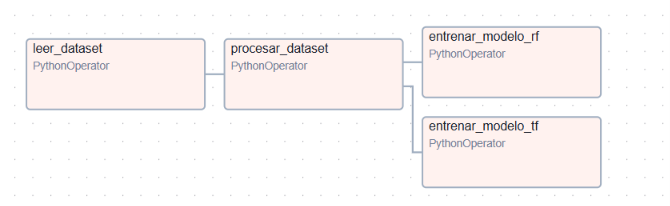
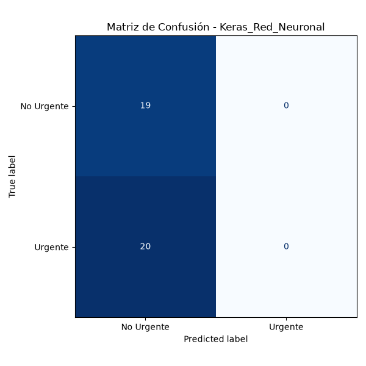
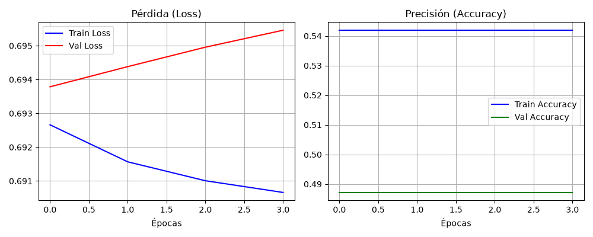

# Proyecto Urgencias

## 1. Contexto y objetivos

La saturación de las urgencias representa un desafío para la eficiencia operativa. La correcta priorización de un paciente a su llegada a urgencias es vital para garantizar que aquellos con condiciones críticas sean atendidos con la mayor brevedad posible, optimizando los recursos disponibles.

Se requiere entrenar, diseñar e integrar un modelo con el objetivo de determinar el nivel de urgencia de un paciente a su llegada a urgencias permitiendo una priorización más ágil y eficaz.

## 2. Dataset (MIMIC-IV-ED Demo)

Dataset: [MIMIC-IV-ED Demo](https://physionet.org/content/mimic-iv-ed-demo/2.2/)
Número de registros brutos: 222
Campos: 
    1. subject_id	
    2. stay_id	
    3. temperature	
    4. heartrate	
    5. resprate	
    6. o2sat	
    7. sbp	
    8. dbp	
    9. pain	
    10. acuity	
    11. chiefcomplaint

### 2.1. Variable objetivo

`acuity`

La variable que buscamos predecir, llamada acuity, indica el nivel de urgencia o la gravedad con la que llega un paciente a urgencias. Funciona como una escala del 1 al 5: los números más bajos (como el 1 y el 2) corresponden a situaciones críticas que exigen atención médica inmediata para evitar riesgos vitales, mientras que los valores del 3 al 5 son para casos más estables o menores. 

Para que al modelo le resulte más sencillo entenderlo, esta escala se simplifica en dos grandes grupos (separando los casos más graves de los que pueden esperar), lo que sirve de guía para que el sistema aprenda a relacionar las constantes vitales del paciente con la prioridad médica real que recibió.

## 3. Análisis del dataset
Para el desarrollo y entrenamiento del sistema de triaje predictivo se ha empleado el conjunto de datos [MIMIC-IV-ED](https://physionet.org/content/mimic-iv-ed-demo/2.2/) en su versión de demostración (Demo 2.2) disponible en PhysioNet.

Este dataset proporciona registros clínicos estructurados, anónimos y de alta fidelidad procedentes de los servicios de urgencias de un hospital de gran escala, simulando un entorno clínico real y complejo.

### 3.1. Matriz correlación

## 4. Limpieza del dataset

### 4.1. Descartes y transformaciones

- Limpiar valores nulos de todos los campos y eliminar esos registros.
- Eliminar las columnas `subject_id` y `stay_id` por no ser datos relevantes para el entrenamiento del modelo.
- Eliminar la columna `chiefcomplaint` por la inconsistencia de su contenido y la dificultad de normalizar sus valores.
- Binarizar `acuity` a:
  - 0: urgente (acuity 1-2)
  - 1: no urgente (acuity 3-5)
- Reemplazar por 0 en columna `pain` los valores UA, unable, uta, ett, o.

### 4.2. Resultado limpieza

Número de registros tras limpieza: 190
Campos finales del dataset: 
    1. temperature	
    2. heartrate	
    3. resprate	
    4. o2sat	
    5. sbp	
    6. dbp	
    7. pain	
    8. acuity	

### 4.3. Partición train/test

En los tres modelos se aplica una partición estándar del conjunto de datos del 80% para entrenamiento (X_train, y_train) y un 20% para prueba (X_test, y_test), fijando una semilla aleatoria (random_state=42) para asegurar la reproducibilidad de los resultados.

## 5. El modelo

### 5.1. Pruebas

### 5.2. Creación

### 5.3. Entrenamiento

### 5.4. Evaluación

### 5.5. Predicción

### 6. Flujo Airflow

El flujo de trabajo se gestiona a través de un DAG (Triaje_DAG) dividido en varias tareas modulares que se ejecutan en colas específicas de Celery:

|                        | Descripción                                                                                                                       | Queue              | Fichero              |
| ---------------------- | --------------------------------------------------------------------------------------------------------------------------------- | ------------------ | -------------------- |
| **leer_dataset**       | Carga inicial del archivo *triaje.csv.gz* y guarda los datos en un dataframe.                                                     | ``low_tier_tasks`` | *data_processing.py* |
| **procesar_dataset**   | Limpia los datos y los filtra para guardarlos en un archivo csv (triaje_limpio.csv). Elimina valores nulos y binariza ``acuity``. | ``cpu_tasks``      | *data_processing.py* |
| **entrenar_modelo_rf** | Entrena en paralelo un clasificador Random Forest Classifier. Evalúa precisión y registra modelo y matriz de confusión.           | ``gpu_tasks``      | *model_training.py*  |
| **entrenar_modelo_tf** | Entrena en paralelo una red neuronal en Keras y guarda artefactos MLflow.                                                         | ``gpu_tasks``      | *model_training.py*  |
**Estructura de ejecución del flujo:**

### 7. Versionado con MLflow

Los artefactos se gestionan a través del archivo *src/triaje/utils.py* mediante las funciones ``plot_keras_history`` y ``plot_matriz_confusion`` que se registran directamente en la interfaz MLflow.

Matriz de confusión de la Red Neuronal Keras:

Curvas de Loss y Acuracy de entrenamiento de Keras:

### 8. Limitaciones y consideraciones

